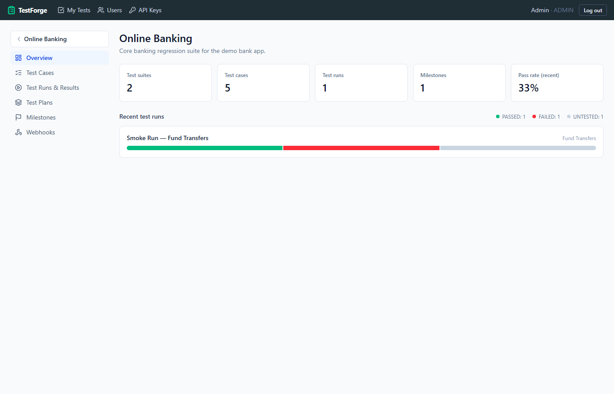
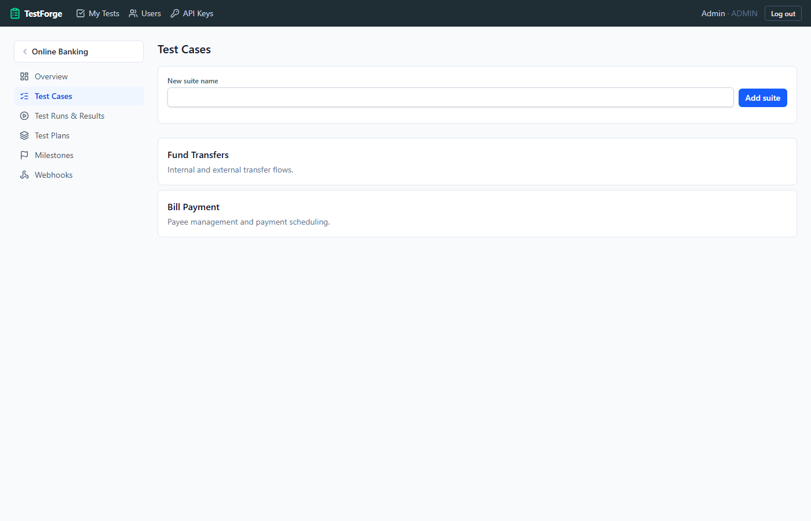
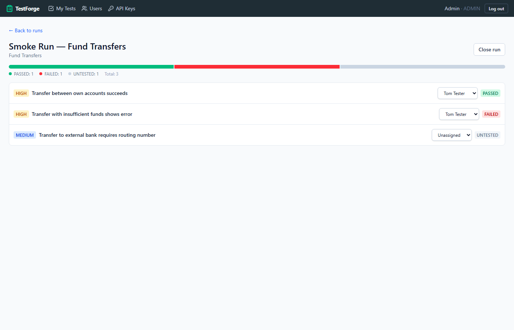

# TestForge

A full-stack [TestRail](https://www.testrail.com/) clone — test case management, test execution, planning, reporting, defect tracking, a documented REST API, CSV import/export, and outbound webhooks. Built as a portfolio project demonstrating full-stack engineering (Node/Express/Prisma backend, React/TypeScript frontend), and designed to be an actually-usable internal test case management tool, not just a demo.

## Screenshots

**Projects**


**Test case management**


**Test run execution**


## Features

- **Test case management** — Projects → Suites → Sections (nested tree) → Test Cases, four templates (Text/Steps/Exploratory/BDD), reusable Shared Steps, project-scoped Labels, filter/sort, bulk edit, drag-and-drop move, soft-delete + restore, CSV import/export (column and section picker, `Sections Hierarchy` paths) and Gherkin `.feature` import/export
- **Test execution** — snapshot-based runs (editing or deleting a case later never alters a run's history), pass/fail/blocked/retest with optional per-step results, comments, defect links, file attachments, version/elapsed tracking, full result history, and keyboard shortcuts (`P`/`F`/`B`/`R`) with Pass & Next auto-advance
- **Assignment & to-do** — five ways to assign tests (inline, bulk, filter-and-assign-all, at run creation, at result submission); a cross-project "My Tests" view (Active/Upcoming) and an admin/lead Workload chart
- **Planning** — Test Plans group runs together, optional Configurations for running one plan across multiple browsers/environments, and Rerun (clone failed/blocked/retest tests into a fresh run without touching the original)
- **Milestones** — due dates, an Upcoming/Open/Completed lifecycle, parent/child hierarchy, and date inheritance down to Plans and Runs
- **Reporting** — 14 report types across Cases, Defects, Results, and Summary categories (activity, coverage, property distribution, cases×runs comparison matrices, milestone/plan/project/run summaries), each with CSV download, print-to-PDF, and click-to-filter drilldown
- **Defect tracking** — a project-wide defect rollup, a "Draft defect for Jira" generator, and Jira-bulk-import-shaped CSV export (a documented stand-in — not a live Jira integration)
- **Dashboards & activity** — a cross-project dashboard, per-project Overview, per-case History & Context, and a curated Activity log for destructive/high-impact actions
- **REST API** — versioned (`/api/v1`), documented with OpenAPI/Swagger UI, dual auth (session JWT or long-lived API key)
- **Webhooks** — outbound HMAC-signed notifications on run created/completed and case created events, with a delivery log and test-ping button
- **Auth & RBAC** — JWT access tokens + rotating opaque refresh tokens (reuse-detection), API keys, four roles (Admin/Lead/Tester/Viewer) enforced server-side
- **Admin UI** — user provisioning (no public self-registration, matching real TestRail), self-service API key management
- **Light/dark theme** — persists across visits, defaults to your OS preference

## Tech stack

**Server:** Node.js · TypeScript · Express · Prisma (SQLite) · Zod · Jest/Supertest · swagger-ui-express
**Client:** React · TypeScript · Vite · Tailwind CSS v4 · TanStack Query · React Router · lucide-react
**Monorepo:** npm workspaces

## Quick start

```bash
npm install
cd server && npx prisma migrate dev && npx tsx prisma/seed.ts && cd ..
npm run dev
```
Open **http://localhost:5173** and log in with `admin@testforge.local` / `ChangeMe123!` (three more demo accounts — Lead/Tester/Viewer — are listed in [SETUP.md](SETUP.md)).

API docs: http://localhost:4000/api/v1/docs

For a full walkthrough of every feature, see **[docs/USER_GUIDE.md](docs/USER_GUIDE.md)**. For detailed setup steps, troubleshooting, and what to do if you're running this from a zipped copy on a different machine, see **[SETUP.md](SETUP.md)**.

## Architecture notes

Data model rationale, auth design, and module-by-module conventions are documented in [CLAUDE.md](CLAUDE.md) (root), [server/CLAUDE.md](server/CLAUDE.md), and [client/CLAUDE.md](client/CLAUDE.md) — written to onboard a new contributor (human or AI) to the codebase's non-obvious decisions, not just what the code does.

## Testing

```bash
npm test   # server: Jest + Supertest, 149 tests across 27 files (auth/cases/suites/projects/runs/plans/milestones/csv/webhooks/me/defects/filter/labels/bulk/sections/audit/configurations/gherkin/attachments/results/reports and more)
```
Every frontend flow was additionally browser-verified end-to-end (not just typechecked) during development — see the client README notes for details.

## Roadmap

**Complete:** the full TestRail-parity backlog (test case templates, Shared Steps, BDD `.feature` import/export, Labels, bulk ops, drag-and-drop, Milestones, Configurations, Rerun, Activity log, dashboards, keyboard shortcuts, Attachments, CSV/`.feature` import/export) plus a 14-report Reporting feature (Cases/Defects/Results/Summary categories, CSV download, print, drilldown). See [CLAUDE.md](CLAUDE.md) for the phase-by-phase history.

**Still open:** generic custom fields per project, a full cross-group run configuration matrix (a simpler single-group Configurations feature is already built), per-project roles (roles are currently global), a Postgres deployment path, and a CI pipeline.

**Explicitly out of scope**, not oversights (see [CLAUDE.md](CLAUDE.md) for the full reasoning): an AI Evaluation case template, XML/Excel import-export, TestRail's full 4-step CSV import wizard, dynamic run filters, a live Jira integration, and scheduled/emailed reports.

## License

Personal portfolio project — no license file yet; treat as all-rights-reserved unless you hear otherwise from the author.
